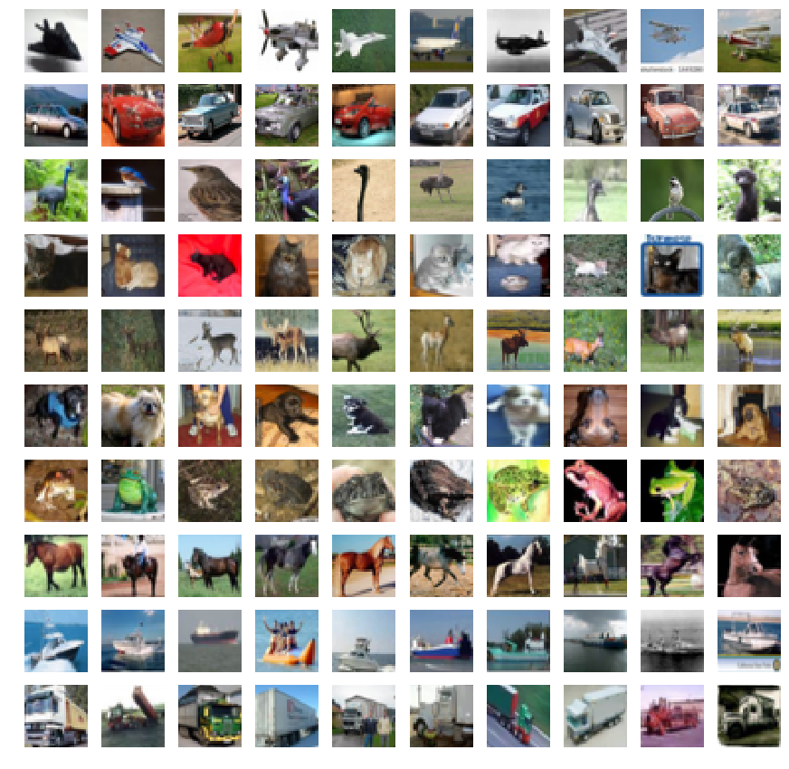

# cifar10-cnn
Some experiments with CIFAR-10 dataset

# About

# Loading CIFAR10 dataset
```python
import myutils
data_training, data_testing = myutils.load_CIFAR_dataset()
```
# Visualization of some examples from each class
see [CIFAR10-visualization.ipynb](CIFAR10-visualization.ipynb)

