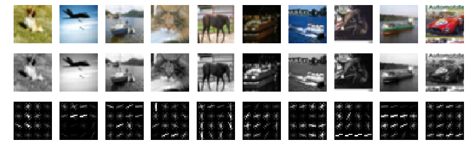

# CIFAR10 classification experiments
Here we present our experiments with classification of images from [CIFAR-10](https://www.cs.toronto.edu/~kriz/cifar.html) dataset.

## Dataset

[CIFAR-10](https://www.cs.toronto.edu/~kriz/cifar.html) database consists of 60000 color images in 10 classes `['plane','auto','bird','cat','deer','dog','frog','horse','ship','truck']`.
Each image is of the size 32x32 with RGB features, so the single data sample has 32x32x3=3072 features.

The dataset is partitioned to training (50000) and testing (10000) samples.

### Loading dataset

The script `myutils.py` provides very simple procedure for (down)loading the data.

```python
import myutils
data_training, data_testing = myutils.load_CIFAR_dataset()
```
When loaded, `data_training` is a list of training images and its labels. For example, the $k$-th image is stored in the array `data_training[k][0]` (with shape `(32,32,3)`) and its label is `data_training[k][1]` (integer number in `range(10)`).

### Some example images

The `iPython` notebook
[CIFAR10-visualization.ipynb](CIFAR10-visualization.ipynb)
presents some examples images from each of 10 classes in CIFAR10.


## Classification

In our case, the classification problem means the supervised learning using only the **training** data (50000 images of CIFAR10).
We measure the **accuracy** of any model using **testing** data.

Of course there are many approaches to the classification problem.
Here we applied the **feature extraction** preprocessing approach in order to finally build the linear classifiers to learn the new (possibly separable) features. One can try to use nonlinear techniques, as well. However our goal is to build (possibly using nonlinear techniques) such features to be finally  simply separable by linear classifier.

### HOG features
The first approach extracts features using *histograms of oriented gradients*
of the images.
<center></center>
This approach does not give spectacular results.
We obtained the accuracy about **49--51%** on top of HOG features; see [Classification_using_HOG_features.ipynb](Classification_using_HOG_features.ipynb)
for more details.
This is far from the best results in CIFAR10 classification challenge; see Rodrigo Benenson's
[ranking](http://rodrigob.github.io/are_we_there_yet/build/classification_datasets_results.html#43494641522d3130)

### Transfer learning
